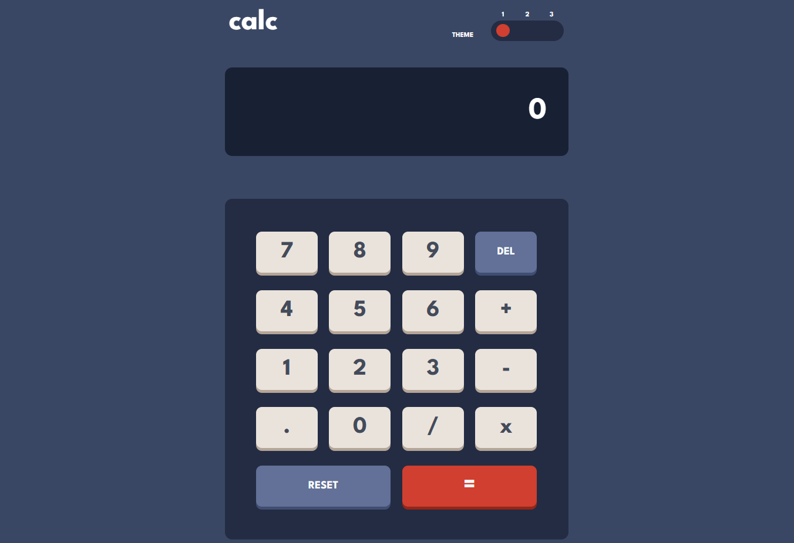

# Frontend Mentor - Calculator app solution

This is a solution to the [Calculator app challenge on Frontend Mentor](https://www.frontendmentor.io/challenges/calculator-app-9lteq5N29). Frontend Mentor challenges help you improve your coding skills by building realistic projects. 

## Table of contents

- [Overview](#overview)
  - [The challenge](#the-challenge)
  - [Screenshot](#screenshot)
  - [Links](#links)
- [My process](#my-process)
  - [Built with](#built-with)
  - [What I learned](#what-i-learned)
  - [Continued development](#continued-development)
  - [Useful resources](#useful-resources)
- [Author](#author)

**Note: Delete this note and update the table of contents based on what sections you keep.**

## Overview

### The challenge

Users should be able to:

- See the size of the elements adjust based on their device's screen size
- Perform mathmatical operations like addition, subtraction, multiplication, and division
- Adjust the color theme based on their preference
- **Bonus**: Have their initial theme preference checked using `prefers-color-scheme` and have any additional changes saved in the browser

### Screenshot

### Links

- Solution URL: [URL here](https://www.frontendmentor.io/solutions/calculator-app-with-scss-for-theme-selection-FR8JL8GHnw)
- Live Site URL: [URL here](https://hnvkhanh.github.io/calculator-app/)

## My process

### Built with

- Semantic HTML5 markup
- SCSS
- Boostrap 5
- Vanilla JavaScript -> TypeScript
- Mobile-first workflow

### What I learned

Using `@mixin` in SCSS.

### Continued development

The responsive feature on this project is not optimized yet. 

### Useful resources

- [Bootstrap 5](https://getbootstrap.com/docs/5.2/getting-started/introduction/) - I used Bootstrap when working with grid.
- [SCSS/Sass](https://sass-lang.com/) - A nice choice when it comes to theme selection, using SCSS help me saving so much time.
- [w3schools](https://www.w3schools.com/) - A great website to review HTML/CSS/JavaScript syntax.

## Author

- Frontend Mentor - [@hnvkhanh](https://www.frontendmentor.io/profile/hnvkhanh)
